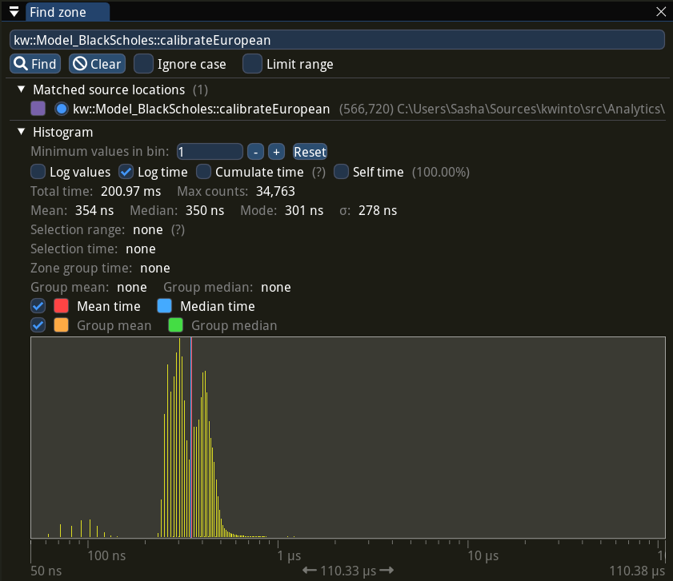
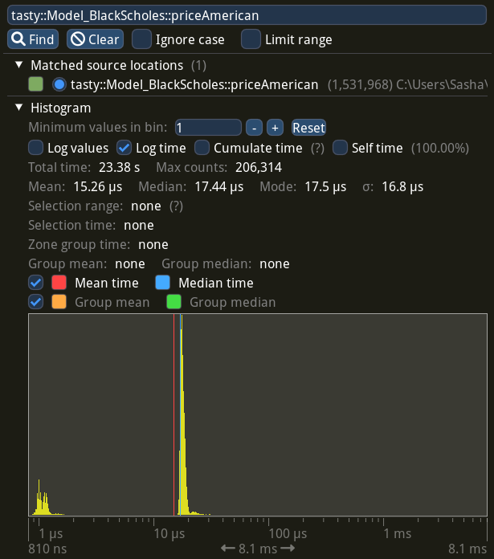
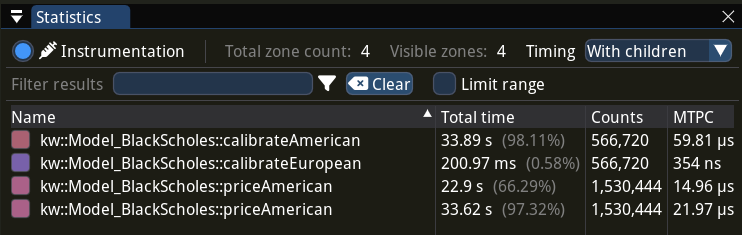

**In this post**, you will learn how to calibrate American options in C++. We will use modern
methods and open-source tools, so the calibration process will be really fast and accessible to
everyone.

**Source code** is located in [gituliar/tastyhedge](https://github.com/gituliar/tastyhedge) on
GitHub. You can build and run it yourself on Linux / Windows or use it as an inspiration for your
own projects. _Market data_

**Calibration** is a process of fitting model parameters to the market data. The purpose of the
model itself is to quantify the risks, which is an inevitable step to build advanced hedging and
trading strategies.

**Black-Scholes model** with early exercise is our main focus. It's suitable for pricing equity
options, which are mostly of American style. Models with the early-exercise feature have no
analytical solution and usually are solved with time-consuming numerical methods. We'll use a
[boundary-interpolation](https://papers.ssrn.com/sol3/papers.cfm?abstract_id=2547027) method, which
is available in
[QuantLib](https://hpcquantlib.wordpress.com/2022/10/09/high-performance-american-option-pricing/).
This modern method is very fast and is essential for anyone interested in quantitative finance.

**In my previous post**, I discussed in details another method for pricing American options --
[finite-difference](/blog/finite-difference-americans) method. This method is much slower, however
more universal and can be used to solve a broader range of problems, similar to Monte-Carlo. Every
seasoned quant I met is familiar with this method.

## Introduction

**Trading options** is possible without a risk management strategy. You don't necessary need to
understand a pricing model and all risk measures it calculates (like delta, vega, gamma, etc.).
Option prices are available in the trading app that is provided by your broker. You can buy or even
sell options pretty much like you do with stocks.

**A naive approach** like this, will eventually lead to a disaster very soon. Hence, if your
intention goes beyond betting on a stock market with options, you'd better hedge your portfolio and
keep under control your risk limits.

**Implied volatility** is what defines the Black-Scholes model, which we consider to use for risk
management, as option prices alone can't quantify the underlying risks. Your broker will likely
provide implied volatility data, however keep in mind that:

- **Pricing model** is another piece that you need to make IV useful. The model is an engine that
  quantifies the risks, given the implied volatility and observable market data (such as option
  price, stock price, interest rate, and dividend rate). For example, it might differ if you use
  Black-Scholes model for American or European options.
- **Market Data** Option exchanges do not provide implied volatility and should be calculated by the
  broker itself. This is a non-trivial and time-consuming task...

## Prerequisite

**Imagine for a moment** that we want to run a brokerage business. Apart from the main service -- to
execute client orders -- we also want to provide volatility data, so that our clients can manage
risk of their positions and survive in the whirl of the financial markets. In addition, we might
consider to manage risk of our own positions if we decide to take some risk too.

**Market data** is provided by the exchange. This includes option prices, volume, open interest,
etc. Perfectly, we'd like to get this data in real-time, however for the calibration exercise we are
fine with historical data that is available on the internet for some small fee.

**Tesla (TSLA)** is good candidates to test our approach. Liquid. No dividends. As an example, let's
look at 5-min snapshots of Tesla options on 2023-05-01. In total, there are 566'720 options to price
on that day, which gives 7'268 options every 5 min.

**Interest rate** is another input to the Black-Scholes model. The source of this data is largely
depends on how you hedge the interest-rate risk. As we are not interested in this for the moment,
let's take freely available
[Daily Treasury Par Yield Curve Rates](https://home.treasury.gov/resource-center/data-chart-center/interest-rates/TextView?type=daily_treasury_yield_curve)
from the U.S. Treasury.

You will find market data in
[gituliar/tastyhedge/mds](https://github.com/gituliar/tastyhedge/tree/main/mds).

**Risk analytics** is the last piece we need to run our brokerage firm. This sort of programs is
proprietary and expensive, however we can build it ourselves. After all, that's what this post is
about, so let's dive in.

## Step 1: European Calibration

**The first step** in our approach is to calibrate European options. The idea is to start with the
European volatility and adjust it repeatedly until it replicates the American price. For more
details see Step 3.

**European calibration** has no closed-form solution. Fortunately, there is a very efficient
numerical algorithm: [Let's Be Rational](http://www.jaeckel.org/) by Peter Jaeckel. Its reference
implementation is available in C++ and other languages. Here is the C++ code:

<!-- **`implied_volatility_from_a_transformed_rational_guess`** function from `lets_be_rational.cpp`
which -->

```cpp
/// File: src/Analytics/Model_BlackScholes.cpp

Error
calibrateEuropean(
  f64    v,     //  option price
  f64    s,     //  stock price
  f64    k,     //  strike
  f64    dte,   //  days to expiration
  f64    r,     //  interest rate
  f64    q,     //  dividend rate
  Parity w,     //  put / call
  f64&   z)     //  implied volatility
{
  f64 t = dte / kDaysInYear;
  f64 k_ = k * exp(-t * r);

  z = implied_volatility_from_a_transformed_rational_guess(v, s, k_, t, w);

  return "";
}
```

### Performance

**2'800'000 opt/s** is as many European options I'm able to calibrate on my machine with AMD Ryzen 9
CPU. You may wonder whether this is a lot or not ?

**The options market** has about 1'500'000 options listed on 5'000 stocks. Hence, we can calibrate
the entire market in just 1/2 of a second on a single CPU core. Of course, this is not a nanosecond
scale, required for high-frequency trading, however it's more than enough for most hedging and
trading strategies.

**Advanced statistic** with per-call distribution time of `calibrateEuropean`, collected with
[Tracy](https://github.com/wolfpld/tracy) profiler, looks as following:



## Step 2: American Pricing

**The second step** is to adjust our initial estimate to a desired tolerated error. You'll see how
to do this in the next step. For now we need to learn how to efficiently price American options.

**American pricing** is costly because of the early-exercise feature. Fortunately, there is a modern
[boundary-interpolation](https://papers.ssrn.com/sol3/papers.cfm?abstract_id=2547027) method by
Andersen et al. It's available in
[QuantLib](https://hpcquantlib.wordpress.com/2022/10/09/high-performance-american-option-pricing/)
and is probably the fastest method to price American options.

**QuantLib** is an advanced library with many features, so we need to perform some preparation steps
prior to calling the pricing algorithm:

```cpp
/// File: src/Analytics/Model_BlackScholes.cpp

Error
priceAmerican(f64 s, f64 k, f64 dte, f64 z, f64 r, f64 q, Parity w, f64& v)
{
  /// Anchor + Maturity
  ///
  auto anchor = ql::Date(31, ql::Jul, 1944);
  auto act365 = ql::Actual365Fixed();
  auto maturity = anchor + std::ceil(dte);

  ql::Settings::instance().evaluationDate() = anchor;

  /// Option Data
  ///
  ql::Option
    w_ = (w == kParity_Call) ? ql::Option::Call : ql::Option::Put;

  ql::Handle<ql::YieldTermStructure>
    r_ = make_shared<ql::FlatForward>(anchor, r, act365);

  ql::Handle<ql::YieldTermStructure>
    q_ = make_shared<ql::FlatForward>(anchor, q, act365);

  ql::Handle<ql::Quote>
    s_ = make_shared<ql::SimpleQuote>(s);

  ql::Handle<ql::BlackVolTermStructure>
    z_ = make_shared<ql::BlackConstantVol>(anchor, ql::TARGET(), z, act365);

  /// Black-Scholes Model
  ///
  auto bsm = make_shared<ql::BlackScholesMertonProcess>(s_, q_, r_, z_);
  auto engine = make_shared<ql::QdFpAmericanEngine>(
    bsm, ql::QdFpAmericanEngine::fastScheme());

  auto payoff = make_shared<ql::PlainVanillaPayoff>(w_, k);
  auto americanExercise = make_shared<ql::AmericanExercise>(anchor, maturity);
  ql::VanillaOption americanOption(payoff, americanExercise);

  americanOption.setPricingEngine(engine);

  /// Boundary-Interpolation Pricer
  ///
  try {
      v = americanOption.NPV();
  }

  /// Error Handling
  ///
  catch (...) {
      std::exception_ptr ep = std::current_exception();
      try {
          std::rethrow_exception(ep);
      }
      catch (std::exception& e) {
          return "priceAmerican : "s + e.what();
      }
  }

  return "";
}

```

### Performance

**45'000 opt/s** is as many American options I can price on the same machine. It's not as impressive
as 2'800'000 opt/s for European calibration. But it's about 100x faster than pricing with the
finite-difference method. See my post on
[pricing American options on CPU and GPU](blog/pricing-derivatives-on-a-budget/) for detailed
benchmarks.

**Advanced statistic** with per-call distribution time of `priceAmerican`, collected with
[Tracy](https://github.com/wolfpld/tracy) profiler, looks as following:



## Step 3: American Calibration

**The third step**, and the final one, is to adjust our initial estimate repeatedly until it
replicates the American price to the desired tolerance. As option prices are quoted with $0.01 step,
we can safely tolerate the error within that range.

**[Newton's](https://en.wikipedia.org/wiki/Newton%27s_method) method** is a classical algorithm to
numerically find roots of a real-valued function. In our case, the function is a difference between
the model and market prices of the option, while unknown variable is implied volatility.

The final implementation looks as:

```cpp
/// File: src/Analytics/Model_BlackScholes.cpp

Error
calibrateAmerican(f64 v, f64 s, f64 k, f64 dte, f64 r, f64 q, Parity w, f64& z)
{
  Error err;

  /// Initial guess
  ///
  if (auto err = calibrateEuropean(v, s, k, dte, r, q, w, z); !err.empty())
    return "calibrateAmerican : " + err;

  /// Newton's solver
  ///
  f64 v_ = v;
  s16 n = 16;
  while (n-- > 0 && !std::isnan(z)) {
    if (auto err = priceAmerican(s, k, dte, z, r, q, w, v_); !err.empty())
      return "calibrateAmerican : " + err;
    if (std::isnan(v))
      break;

    const f64 tolerance = 0.005;
    if (std::abs(v - v_) < tolerance)
      /// Solution found
      return "";

    /// Boundary-Interpolation Pricer
    ///
    f64 vUp;
    const f64 dz = 0.0001;
    if (err = priceAmerican(s, k, dte, z + dz, r, q, w, vUp); !err.empty())
      break;

    /// Finite-difference derivative
    ///
    f64 dvdz = (vUp - v_) / dz;
    z -= (v_ - v) / dvdz;
  }

  /// No solution
  ///
  z = NaN;
  return err;
}

```

### Performance

**16'500 opt/s** is as many American options I can calibrate on my machine. Effectively, we make 3
pricing calls per calibration. Eventually, it's 170x slower than European calibration with
[Let's Be Rational](http://www.jaeckel.org/) by Jaeckel, but much faster if using the
finite-difference.

**Advanced statistic** with per-call distribution time of `calibrateAmerican`, collected with
[Tracy](https://github.com/wolfpld/tracy) profiler is shown below.

**The distribution** indicates that:

- Deep in- and out-the-money options are cheap to calibrate, as the volatility is the same for
  European and American cases, hence the initial guess is already an answer, the biggest spike
  around 10 us region (to the left of the median time).
- At-the-money options, on the other hand, require several adjustment steps, hence more
  `priceAmerican` calls. See spikes around 100 us region:


## Conclusion

In order to build advanced hedging and trading strategies, portfolio managers need to quantify
underlying risks of their portfolios. This is what pricing models are used for.

In this post, we saw how to calibrate the Black-Scholes model to real
[American option prices](https://github.com/gituliar/tastyhedge/blob/main/mds) and
[yield curve rates](https://home.treasury.gov/resource-center/data-chart-center/interest-rates/TextView)
using C++ and modern quantitative methods. We discussed performance of our implementation by
calibrating quotes of the Tesla options.

Our approach allows to calibrate **16'500 opt/s** on a single AMD Ryzen 9 core. At this speed we can
calibrate bid and ask prices for the entire market of **1'500'000 options** listed on **5'000
stocks** in just **90 s**.


